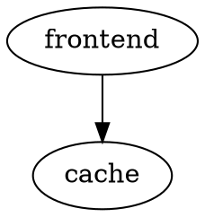

# Graph Serialization Format: Design Note

## Context

The `rad graph build` command produces a static, code-grounded artifact
describing a Radius application: its resources, their connections, and source
code provenance. That artifact is consumed by visualizers (browser extension,
docs site) and, eventually, by query and lint tooling.

---

## 1. `ApplicationGraphResponse` that isn't renderer-friendly

We already emit `ApplicationGraphResponse` — a domain model organized around
Radius resources and their typed connections. It is the right shape for the
RP, for diffing, and for anything that needs to know *what kind of
connection* exists between two resources.
A renderer wants a flat list of nodes and a flat list of edges. To get there from `ApplicationGraphResponse`, every
consumer has to walk the structure, flatten it, dedupe edges (each
connection appears on both endpoints), and project labels itself. We were
asking every visualizer to redo the same work.

## 2. Renderers disagree on the data shape

Worse, "flat list" doesn't mean one thing. Each rendering library has its
own opinion:

| Renderer            | Encoding  | Top-level shape                                | Edge reference        | Layout coupling           | Typed relationships       |
| ------------------- | --------- | ---------------------------------------------- | --------------------- | ------------------------- | ------------------------- |
| **Cytoscape.js**    | JSON      | Single flat `elements: [...]` list             | by node `id`          | Separate (`layout` opts)  | Free-form `data`          |
| **D3 / vis.js**     | JSON      | Parallel `nodes: [...]`, `links\|edges: [...]` | by `id` **or** index  | Computed at runtime       | Free-form per edge        |
| **React Flow**      | JSON      | Parallel `nodes: [...]`, `edges: [...]`        | by node `id`          | **Required** `position`   | Free-form `data`          |
| **Neo4j / Cypher**  | JSON/bolt | Property graph: nodes + relationships          | by node identity      | None (it is a database)   | First-class typed `:REL`  |

The same 2 nodes + 1 edge look like this in each:

**Cytoscape.js** — one flat list, group tag distinguishes nodes from edges:

```json
{
  "elements": [
    { "group": "nodes", "data": { "id": "frontend" } },
    { "group": "nodes", "data": { "id": "cache" } },
    { "group": "edges", "data": { "id": "frontend->cache", "source": "frontend", "target": "cache" } }
  ]
}
```

**D3 / React Flow** — two parallel arrays:

```json
{
  "nodes": [
    { "id": "frontend" },
    { "id": "cache" }
  ],
  "edges": [
    { "id": "frontend->cache", "source": "frontend", "target": "cache" }
  ]
}
```

**Graphviz DOT** — textual, not JSON:



**Neo4j / Cypher** — property graph with typed relationships:

```cypher
CREATE (f:Container { name: "frontend" })
CREATE (c:RedisCache { name: "cache" })
CREATE (f)-[:CONNECTS_TO { direction: "outbound" }]->(c);
```

Picking one of these as our serialization is a choice; defaulting to the
domain model and pushing the work to every consumer is also a choice. 

## 3. The decision: emit two projections

There is no single shape that serves both consumer classes:

1. **Radius model consumers** dashboard want
   the rich application schema with full resource types, connection
   directions, etc. Most rad commands also support -o json to output the model as a json.
2. **Visualization consumers** want a flat, pre-flattened list of nodes and
   edges ready to hand to a renderer with minimal transformation step.

So `rad graph build` takes an output flag — `-o, --output json | renderable | both` — alongside `-f, --file <path>` for where to write it. The values are named for the *consumer*, not the internal shape:

- `json` (default) — the existing `ApplicationGraphResponse` (domain model). Same convention as `-o json` on other `rad` commands.
- `renderable` — flat `{ elements: [{ group, data }] }` list ready for a graph renderer.
- `both` — combined artifact `{ application, elements }` so a single file
  can serve both classes of consumer.

## 4. Why the flat element list is the right first format

Here is the approximate adapter code each renderer needs to consume our `{ elements: [{group, data}] }`
output. This is minimal compared to pushing the logic of transforming `ApplicationGraphResponse`
to each renderer.

**Cytoscape.js — no transform.** Cytoscape consumes our shape directly:

```js
cy.add(graph.elements);
```

**D3 force layout — partition by `group`, take `.data`.** D3 already expects
`{id}` on nodes and `{source, target}` on links, which our `data` already
carries:

```js
const nodes = graph.elements.filter(e => e.group === 'nodes').map(e => e.data);
const links = graph.elements.filter(e => e.group === 'edges').map(e => e.data);
```

**React Flow — same partition, plus a placeholder `position`.** React Flow
requires every node to have a position; the data mapping itself is still
trivial, and you fill in `position` from a layout engine like dagre or elk:

```js
const rfNodes = graph.elements
  .filter(e => e.group === 'nodes')
  .map(e => ({ id: e.data.id, data: { label: e.data.label }, position: { x: 0, y: 0 } }));

const rfEdges = graph.elements
  .filter(e => e.group === 'edges')
  .map(e => ({ id: e.data.id, source: e.data.source, target: e.data.target }));
```

**vis.js — same idea, with a `source/target` → `from/to` rename:**

```js
const nodes = graph.elements
  .filter(e => e.group === 'nodes')
  .map(e => ({ id: e.data.id, label: e.data.label }));

const edges = graph.elements
  .filter(e => e.group === 'edges')
  .map(e => ({ from: e.data.source, to: e.data.target }));
```


## 6. The layering, summarized

```
domain model (ApplicationGraphResponse)        ← truth
        |
        ├── -o json         (domain JSON)
        ├── -o renderable   (flat node/edge list, lossy projection)
        └── -o both         (combined: application + elements)
```

The `renderable` projection is intentionally lossy — it drops typed connection
metadata. That is the point: it exists to feed renderers, not to be the
source of truth.

## Decision (recap)

1. Treat the application schema as the domain model; keep emitting it under
   `-o json` (the default, matching the `-o json` convention used elsewhere
   in `rad`).
2. Add a flat node/edge projection under `-o renderable`.
3. Combined artifact `{ application, elements }` under `-o both` so a
   single file can serve both consumer classes.
4. Use `-f, --file <path>` for the output file path (separating *what* to
   write from *where* to write it).
5. Name internal types after the *shape* (`Element`, `ElementData`,
   `GraphArtifact`) — not after any one renderer.

## Out of scope (for now)

- Embedding layout (`position`) in the renderable output — that is a renderer
  concern, not a serialization concern.
- A hand-authored JSON Schema for the renderable output. The Go types in
  [`pkg/cli/graph/elements.go`](../../pkg/cli/graph/elements.go) are the
  schema; if external consumers appear, generate a schema from those types
  rather than maintaining one by hand.

---

# Looking ahead (not now)

The rest of this note is forward-looking. **None of it is on the current
roadmap.** It is captured so we don't have to redo the reasoning when these
questions come up later. Each section layers on top of the artifact above —
it does not replace it.

## Someday: pattern queries

Eventually we will want to ask path-shaped questions of the graph — "which
containers transitively depend on a Redis cache", "what connection-shape
changed between two commits".
A query layer (Cypher, openCypher, or anything similar) operates on a
property graph: **nodes with labels and properties, plus typed directed
relationships with their own properties.**

That is exactly what `ApplicationGraphResponse` carries and what the
`renderable` projection deliberately drops (it loses connection direction and
type, since renderers don't need them). So `-o json` is not just for the
dashboard and `-o json` consumers on other `rad` commands today — it is also
the input shape any future query layer would build on. Retaining it keeps
that door open at zero ongoing cost.
