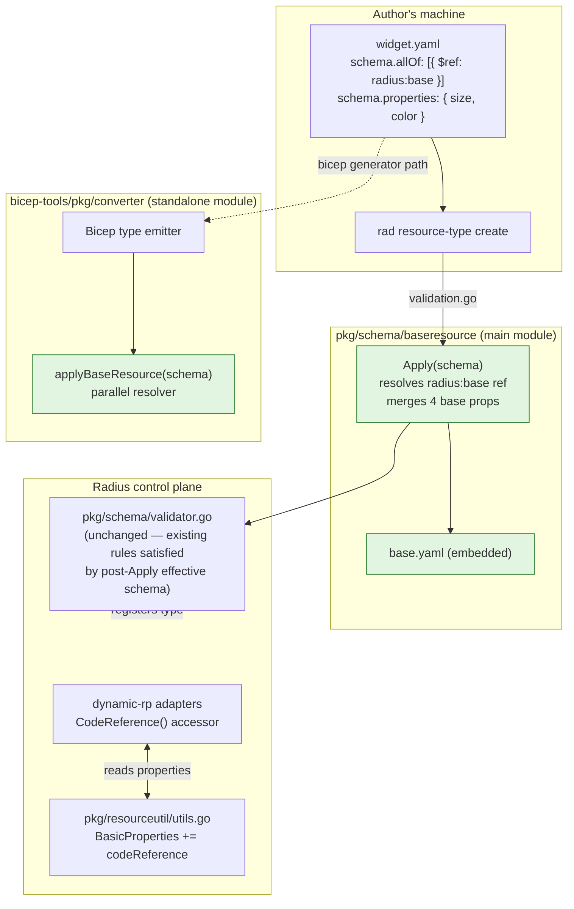

# Base Resource Manifest

* **Author**: @nithyatsu

## Overview

Today every Radius resource type a contributor authors must copy the same four "Radius-aware" schema properties — `application`, `environment`, `connections`, and (newly) `codeReference` — into its manifest YAML. This is rote duplication that authors get wrong and it leaks Radius framework concerns into every per-type schema.

This design introduces a single repo-owned **base resource manifest** that declares those four common properties once. A resource-type author opts a type into the base by adding `allOf: [{ $ref: "radius:base" }]` to its schema. Both the CLI validator (`rad resource-type create`) and the Bicep extension generator (`bicep-tools`) resolve that `$ref` lexically against an embedded base YAML, merge the four properties into the effective schema using per-type-wins precedence, and strip the marker so downstream code never sees an unresolved external reference.

**The existing schema validator is unchanged.** The base manifest declares `environment` in its `required:` array, so any type that opts in keeps `environment` mandatory automatically. A type that does not opt in still has to declare `environment` itself (today's behavior). This feature is therefore a pure ergonomics win for opt-in types and a no-op for everything else — no breaking change.

`codeReference` is introduced as a new recognized common property in this feature. Its v1 wire shape is a single optional string treated as a URI (e.g. a Git URL with commit SHA and line range). A richer structured shape is an additive future change.

## Terms and definitions

| Term | Meaning |
|---|---|
| **Base resource manifest** | The single repo-owned YAML file that declares the four common Radius properties and their shapes. Shipped with Radius, embedded into binaries via `go:embed`. |
| **Common Radius property** | A property whose presence, name, and runtime semantics are defined by Radius itself rather than by the resource-type author. Today: `application`, `environment`, `connections`, `codeReference`. |
| **Type-specific property** | Anything else an author declares under `properties:` in their per-type YAML. |
| **Reserved property name** | A property name authors are forbidden to use (today: `status`, `recipe`). Unchanged by this feature. |
| **Inheritance keyword** | The author-visible opt-in: `allOf: [{ $ref: "radius:base" }]`. The `radius:` URI scheme is reserved for Radius; `radius:base` is the only legal value in v1. |
| **Effective schema** | The schema that downstream consumers (validator, Bicep generator, runtime adapters) see after `Apply()` has resolved the `$ref` and merged the base. The on-disk YAML is the **author's schema**; the effective schema is its post-merge form. |
| **Approach A / Approach B** | Two design options considered for how the base is contributed. A: user-facing `$ref` keyword (this design). B: implicit injection with no author-visible keyword (deferred, possible future POC). |

## Objectives

> **Issue Reference:** specs/210-base-resource-manifest/spec.md

### Goals

- Let a resource-type author register a type whose YAML declares **none** of the four common properties (beyond a one-line `allOf` opt-in) and still get a fully-functional Radius type at deployment time.
- Preserve `environment` as a required property for every opt-in type by carrying it into the effective schema's `required:` array from the base.
- Make the opt-in self-evident in YAML (`allOf: [{ $ref: "radius:base" }]`) so a reader can tell at a glance which types inherit from the base.
- Introduce `codeReference` as a first-class recognized common property with a stable v1 wire format (optional string).
- Ship the base manifest as a single embedded resource — no extra CLI flags, no extra file paths, no network round-trips for `$ref` resolution.
- Keep the change small, isolated, and non-breaking: one new package (`pkg/schema/baseresource/`), one new file in `bicep-tools/pkg/converter/`, three small call-site additions. **No change to the existing schema validator's rules.**

### Non goals

- **No change to the existing schema validator.** The today-rules (including "every schema must declare `environment`") stay exactly as they are. The base manifest works *with* them, not against them.
- **No polished per-type override workflow.** The mechanism that makes per-type declarations win (FR-004) is present, but command-time conflict diagnostics, override-shape validation, and supporting documentation for a "override one of the four" workflow are deferred to a follow-on feature.
- **No user-authored base manifests.** Only `radius:base` is recognized as a `radius:`-scheme `$ref`. Authoring private base manifests (`$ref: "file://./myorg-base.yaml"`, etc.) is out of scope.
- **No Approach B (implicit injection).** Documented as a possible future POC if Approach A proves unacceptable in practice; not pursued in parallel.
- **Base manifest is frozen.** The set of properties in `radius:base` is locked at the four named in this design. Promoting any additional property to common status requires a separate spec — not silent evolution of this base.

### User scenarios

#### User story 1 — Author a new resource type without restating Radius boilerplate (P1)

A platform engineer publishes `MyOrg.Examples/widgets`. Today they have to copy `application`, `environment`, and `connections` into the type's YAML and remember to mark `environment` required. After this feature they write only widget-specific properties (`size`, `color`, `replicaCount`) and one line of opt-in (`allOf: [{ $ref: "radius:base" }]`). `rad resource-type create` succeeds — the base contributes the four common properties and marks `environment` required automatically. A consumer can then write a Bicep resource of type `MyOrg.Examples/widgets` and set `environment`, `application`, `connections`, and `codeReference` exactly as they would on any other Radius resource.

#### Deferred — per-type override workflow

An author overriding exactly one common property on a specific type (e.g. constraining `connections` to a closed set of named keys) is not a prototype goal. FR-004 keeps the underlying mechanism in place; the deferred work is the polished CLI diagnostics and docs around it.

## User Experience

**Sample input — per-type manifest YAML, post-feature:**

```yaml
namespace: MyOrg.Examples
types:
  widgets:
    apiVersions:
      "2026-06-01-preview":
        schema:
          type: object
          allOf:
            - $ref: "radius:base"          # opts into the four common Radius properties
          properties:
            size:
              type: integer
            color:
              type: string
          required:
            - size
```

**Sample input — `rad resource-type create`:**

```sh
rad resource-type create -f widget.yaml
```

No new flags. The base manifest is embedded in the CLI; the `$ref` is resolved at registration time.

**Sample output — a Bicep author consuming the new type:**

```bicep
resource w 'MyOrg.Examples/widgets@2026-06-01-preview' = {
  name: 'my-widget'
  properties: {
    application: app.id
    environment: env.id
    connections: {
      db: { source: pg.id }
    }
    codeReference: 'https://github.com/myorg/repo/blob/<sha>/app.bicep#L42'
    size: 10
    color: 'red'
  }
}
```

`application`, `environment`, `connections`, and `codeReference` are all available even though the YAML never mentioned them — they came from the base.

## Design

### High Level Design

The design has three moving pieces:

1. **`pkg/schema/baseresource/base.yaml`** — the single source of truth. A small YAML file declaring the four common properties, their shapes, and a `required: [environment]` entry. Embedded into Go binaries with `go:embed`.
2. **`pkg/schema/baseresource.Apply(schema)`** — the canonical resolver. Walks a parsed OpenAPI schema's `allOf` array, finds the `radius:base` `$ref` (if any), merges the four base properties into the schema's `properties` map using per-type-wins precedence, unions the base's `required:` entries into the schema's `required:` list, and drops the `$ref` entry from `allOf`. The schema validator (`pkg/cli/manifest/validation.go`) calls this before validating each per-type schema.
3. **`bicep-tools/pkg/converter/baseresource.go::applyBaseResource(schema)`** — a parallel resolver in the standalone `bicep-tools` module. The `bicep-tools` module is intentionally independent of the main Go module, so the base properties are duplicated here as a small Go literal and a sync test asserts the two lists agree.

The existing schema validator in `pkg/schema/validator.go` is **unchanged**. Because `Apply()` runs before validation and inserts `environment` into the effective schema's `properties` map (and into `required:`), the existing "every schema must declare `environment`" rule continues to pass for any opt-in type. A type that does not opt in still has to declare `environment` itself — the same constraint that exists today.

Two small additions complete the wiring:

- `pkg/resourceutil/utils.go::BasicProperties` adds `codeReference` so the runtime's generic property extraction recognizes it as a common property (not as a type-specific property to be passed along verbatim).
- `pkg/dynamicrp/datamodel/dynamicresource.go` adds a `CodeReference()` accessor that mirrors `ApplicationID()` / `EnvironmentID()` so dynamic-rp callers can read the value out of the resource's `properties` map without re-implementing the key lookup.

### Architecture Diagram



### Detailed Design

#### Why a user-facing `$ref` keyword (Approach A)

Two approaches were considered:

- **Approach A (chosen)** — author-visible opt-in via `allOf: [{ $ref: "radius:base" }]`. The relationship between a type and the base is visible in the YAML. Authors who don't want the base just omit the keyword.
- **Approach B (deferred)** — implicit injection. The validator/generator would merge the four properties into every per-type schema unconditionally. No YAML keyword.

##### Advantages of Approach A

- **Self-documenting.** Reading the YAML tells you which types participate in the Radius app/env model and which don't. Approach B hides this in code.
- **Opt-in, not opt-out.** A type that intentionally has no `application`/`environment` (a "raw" type) is the natural case where the keyword is omitted. Approach B has no clean way to express this without adding *another* keyword to suppress injection.
- **Composable with future Radius extensions.** `allOf: [...]` is standard JSON Schema; future base manifests (`radius:network-base`, etc., should they ever ship) slot in as additional entries.
- **Cheap to debug.** When a type behaves unexpectedly, the author can grep their YAML for `radius:base`. With Approach B the cause is invisible without reading Radius source.

##### Disadvantages of Approach A

- One extra line of YAML per type that wants the base — the cost of explicit opt-in.
- A new author has to learn the keyword exists. Mitigated by the contributor doc (`docs/contributing/contributing-code/contributing-code-base-resource-manifest.md`) and the worked example added in this feature.
- The `radius:` URI scheme is custom (RFC 3986 permits this). A reader who hasn't seen it before may try to dereference it as a URL; an actionable error message at registration time mitigates the rest.

##### Proposed option

**Approach A.** OQ-001 in the spec was resolved to A by the clarification session on 2026-06-19. Approach B is preserved in [research.md](specs/210-base-resource-manifest/research.md) as a possible future POC.

#### The base manifest itself

```yaml
type: object
properties:
  application:    { type: string,  description: "Resource ID of the Applications.Core/applications this resource belongs to." }
  environment:    { type: string,  description: "Resource ID of the Applications.Core/environments this resource deploys into." }
  connections:    { type: object, additionalProperties: { type: object }, description: "Map of connection name to source resource ID." }
  codeReference:  { type: string,  description: "Optional URI pointing back to authoring source." }
required:
  - environment
```

Notes:

- The base lists `environment` in `required:`. After `Apply()` unions the base `required:` into the effective schema, every opt-in type gets `environment` required automatically — matching today's contract without any validator change.
- `application`, `connections`, and `codeReference` are **not** in the base `required:` array; they remain optional unless a per-type `required:` adds them.
- The base does **not** include `status` or `recipe`. Those remain reserved-and-forbidden and the base manifest must not introduce a new collision class (FR-008).
- The set is **frozen**. Future Radius releases MUST NOT add, remove, rename, or retype a property in this file. Adding a new common property requires a separate spec.

#### The resolver (canonical implementation in `pkg/schema/baseresource/loader.go`)

`Apply(schema *openapi3.Schema) error` does exactly the following:

1. If `schema` is nil or `schema.AllOf` is empty: return nil (no-op).
2. Walk `schema.AllOf` looking for the first entry whose `Ref` field starts with `radius:`.
3. If found and the value is exactly `"radius:base"`: continue.
4. If found and the value is any other `radius:` URI: return an actionable error naming the offending value and the `allOf[N]` index. (Future-proofs the namespace; no other `radius:` URI is legal in v1.)
5. If not found: return nil (the schema does not opt into the base — pass through unchanged, and the existing validator's env-required rule still applies to it).
6. Load the embedded base YAML on first call (cached via `sync.Once`).
7. For each of the four base property names, **if the schema does not already declare a property with that name, copy it in from the base.** This is per-type-wins precedence (FR-004): an explicit author declaration of e.g. `environment` keeps its own shape and any per-type `required:` status; only properties the author omitted are filled in.
8. **Union the base's `required:` entries into the effective schema's `required:` list** (deduplicated). This is how `environment` stays mandatory for opt-in types without changing the validator.
9. Drop the matched `radius:base` entry from `allOf`. This is important — once resolved, downstream code (the validator, `kin-openapi`'s native `$ref` resolver) must not see an unresolved external reference.

The resolver is **purely lexical**. No network. No UCP round-trip. No file I/O at runtime (the YAML is embedded). Caching is a single `sync.Once`; per-call work is a small map merge.

#### The `bicep-tools` parallel implementation

`bicep-tools/pkg/converter/baseresource.go` implements `applyBaseResource(schema *manifest.Schema) error` with the same semantics. It exists because `bicep-tools` is a standalone Go module (a deliberate split — it ships as the input to a Bicep extension and must not pull in the full Radius dependency tree).

To prevent drift, the base properties are duplicated as a Go literal in `baseResource.go`, and a synchronization test (`TestApplyBaseResource_PropertiesMatchCanonicalYAML`) loads `pkg/schema/baseresource/base.yaml` and asserts that the parallel list exactly matches. The test fails loudly if the canonical YAML and the bicep-tools copy diverge — which is the only mechanism by which they could ever disagree, since both are frozen.

The Bicep emitter ([bicep-tools/pkg/converter/converter.go#L143](bicep-tools/pkg/converter/converter.go#L143)) calls `applyBaseResource` once per `(provider, type, apiVersion)` triple, just before building the `<Type>Properties` Bicep type. After resolution, the emitter sees a schema with all four properties present and produces a Bicep type definition where consumers can set them as ordinary fields.

#### The schema validator (unchanged)

[pkg/schema/validator.go](pkg/schema/validator.go) contains a hardcoded check that every schema's `properties` map declares `environment`. **This rule is intentionally left in place.** Because `Apply()` runs before validation and merges `environment` into the schema's `properties` map for any type that opts into the base, the rule passes automatically for opt-in types. A type that does not opt into the base still has to declare `environment` itself, just like today.

This is the key property of the design: the feature is purely additive at the validator layer. No rule is changed, no test is inverted, no existing in-repo or out-of-tree type changes behavior.

#### Property-bag changes (`pkg/resourceutil/utils.go`)

`BasicProperties` is the list of property names that Radius's generic property-extraction logic treats as "framework-owned" rather than passing through verbatim. Today: `application`, `environment`, `status`, `connections`. After this feature: same list plus `codeReference`. Without this change, `codeReference` would be silently dropped from a generic resource's surfaced properties because the runtime would not know to look for it.

#### Runtime accessor (`pkg/dynamicrp/datamodel/dynamicresource.go`)

Adds a `CodeReference() string` method on `dynamicResourceBasicPropertiesAdapter` that mirrors `ApplicationID()` / `EnvironmentID()`. It reads `properties["codeReference"]`, type-asserts to string, and returns the empty string for any failure path. Intentionally **not** part of the `v1.BasicResourcePropertiesAdapter` interface yet — static resource types (MongoDB, Redis, …) do not expose `codeReference`. Callers that want it must type-assert to the dynamic adapter explicitly. This keeps the interface stable for now; promoting `CodeReference()` to the interface is a follow-on once static types adopt the property.

### API design

No HTTP API changes. The contracts that change are:

- **The resource-type manifest YAML** gains support for the `allOf: [{ $ref: "radius:base" }]` keyword. Documented in [`specs/210-base-resource-manifest/contracts/inheritance-keyword.md`](specs/210-base-resource-manifest/contracts/inheritance-keyword.md).
- **The base manifest's wire shape** is documented in [`specs/210-base-resource-manifest/contracts/base-manifest.schema.yaml`](specs/210-base-resource-manifest/contracts/base-manifest.schema.yaml). This is the frozen contract Radius commits to.
- **The schema validator's contract is unchanged.** All existing rules (including "every schema must declare `environment`") continue to be enforced; opt-in types satisfy them through the post-`Apply()` effective schema.

No Go-package public-API additions other than the new `pkg/schema/baseresource` package (`Apply`, `PropertyNames`, the `URIScheme` and `URI` constants).

### CLI Design

No new flags, no new commands. `rad resource-type create -f <file>.yaml` continues to be the only authoring command — the base manifest is embedded in the CLI binary.

### Implementation Details

| Component | What changes | File(s) |
|---|---|---|
| Schema base manifest (NEW) | New package `pkg/schema/baseresource` with embedded `base.yaml` (including `required: [environment]`), `Apply()`, `PropertyNames()`. | [pkg/schema/baseresource/base.yaml](pkg/schema/baseresource/base.yaml), [pkg/schema/baseresource/loader.go](pkg/schema/baseresource/loader.go), [pkg/schema/baseresource/loader_test.go](pkg/schema/baseresource/loader_test.go) |
| Schema validator | **Unchanged.** All existing rules stay in place. | [pkg/schema/validator.go](pkg/schema/validator.go) |
| CLI manifest validator | Calls `baseresource.Apply()` before per-schema validation. | [pkg/cli/manifest/validation.go](pkg/cli/manifest/validation.go), [pkg/cli/manifest/validation_test.go](pkg/cli/manifest/validation_test.go) |
| Generic property util | `BasicProperties` adds `codeReference`. | [pkg/resourceutil/utils.go](pkg/resourceutil/utils.go) |
| Dynamic-rp runtime adapter | New `CodeReference()` accessor. | [pkg/dynamicrp/datamodel/dynamicresource.go](pkg/dynamicrp/datamodel/dynamicresource.go), [pkg/dynamicrp/datamodel/dynamicresource_test.go](pkg/dynamicrp/datamodel/dynamicresource_test.go) |
| `bicep-tools` Schema struct | Adds `AllOf` and `Ref` fields. | [bicep-tools/pkg/manifest/manifest.go](bicep-tools/pkg/manifest/manifest.go) |
| `bicep-tools` converter | Adds parallel `applyBaseResource()`; called from `addResourceTypeForAPIVersion`. | [bicep-tools/pkg/converter/baseresource.go](bicep-tools/pkg/converter/baseresource.go), [bicep-tools/pkg/converter/converter.go](bicep-tools/pkg/converter/converter.go) |
| Contributor doc (NEW) | How-to with worked example and "How to test" section. | [docs/contributing/contributing-code/contributing-code-base-resource-manifest/README.md](docs/contributing/contributing-code/contributing-code-base-resource-manifest/README.md) |

#### Core RP

No code changes. Existing core-RP types continue to declare the four common properties explicitly in their static datamodel — they do not go through the manifest-validator path. The validator's removed `environment` rule was never enforced against them at runtime.

#### Portable Resources / Recipes RP

Same as core-RP — unchanged. The change matters for dynamic-rp (which validates user-authored manifests at registration time) and the CLI (which validates manifests at `rad resource-type create` time).

#### UCP / Bicep / Deployment Engine

- **UCP**: unchanged.
- **Bicep**: the Bicep extension generator (`bicep-tools`) is updated as described.
- **Deployment Engine**: unchanged.

### Error Handling

| Failure | Where surfaced | Behavior |
|---|---|---|
| `$ref: "radius:something-else"` in `allOf` | `Apply()` (canonical and bicep-tools) | Returns an actionable error naming the offending value and the `allOf[N]` index. `rad resource-type create` reports it at command time, before any control-plane round-trip. |
| `$ref: "radius:base"` placed under `properties:` instead of `allOf:` | `kin-openapi` parser | Rejected by the parser (it tries to declare a property literally named `$ref`). The author gets a parser-level error; the contributor doc calls out this footgun. |
| Per-type schema declares a common property with an incompatible primitive type (e.g. `environment: { type: integer }`) | The existing FR-007 check inside the validator | Falls through to existing validator behavior — the per-type declaration is what is checked. Per FR-004, per-type wins, so the validator simply rejects the bad shape on the per-type side. |
| Embedded `base.yaml` is malformed | `loadBaseSchema()` at first call | Returns an error wrapped with `baseresource: failed to parse embedded base.yaml`. This is a developer error in this package — production builds cannot hit it because the YAML is checked in. |
| `bicep-tools` parallel list drifts from canonical YAML | `TestApplyBaseResource_PropertiesMatchCanonicalYAML` | Test fails loudly in CI before anything ships. |

## Test plan

| Layer | Test | Asserts |
|---|---|---|
| Unit | `pkg/schema/baseresource/loader_test.go` | `Apply()` no-ops on nil / empty allOf / no `radius:` ref; merges all four base properties on a clean opt-in; unions `required:` so `environment` ends up required after merge; respects per-type-wins on conflicting property declarations; rejects unknown `radius:` URIs with an actionable error. |
| Unit | `pkg/schema/validator_test.go` (regression — unchanged) | Existing tests still pass without modification, including the "missing `environment` is rejected" cases. This is the assertion that the validator is unchanged. |
| Unit | `pkg/cli/manifest/validation_test.go` (updated) | `$ref`-using manifest validates end-to-end (validator sees the post-`Apply()` effective schema and accepts it); a `$ref`-using manifest with `environment` omitted from per-type declarations still passes because the base contributes it; bad `$ref` produces a command-time error. |
| Unit | `pkg/dynamicrp/datamodel/dynamicresource_test.go` (updated) | `CodeReference()` returns the value, empty string when absent, empty string on type mismatch. |
| Unit | `bicep-tools/pkg/converter/baseresource_test.go` | `applyBaseResource()` behaves identically to the canonical resolver across the same cases; parallel-list-matches-YAML sync test. |
| Unit | `bicep-tools/pkg/converter/converter_test.go` (existing, regression) | A per-type YAML that does **not** use `$ref` produces an identical Bicep type to today (no behavior drift for non-opting types). |
| Functional | `test/functional-portable/dynamicrp/noncloud/baseresource_test.go` (NEW) | End-to-end: register a `$ref`-using manifest, deploy an instance, assert the four common properties resolve correctly at runtime. |

## Security

No new attack surface.

- The base manifest is embedded at build time via `go:embed`; it cannot be replaced by an attacker without rebuilding the binary.
- `$ref` resolution is **purely lexical** against the embedded blob. The resolver does not fetch from any URL, does not consult the file system, and does not consult the UCP store. The custom `radius:` URI scheme exists precisely to avoid the security questions that a `http(s)://` `$ref` would raise.
- No secret material flows through the base or the resolver. The four common properties (`application`, `environment`, `connections`, `codeReference`) are all non-sensitive metadata.
- The `codeReference` value is a string the author chooses; tooling that renders it (graph, `rad resource show`) MAY treat it as a clickable link when it parses as HTTP(S), but the control plane does not act on it.

## Compatibility

**No breaking change.** The feature is purely additive.

- **In-tree providers**: unaffected. Every in-repo manifest already declares `environment` in its own `properties:` block, so the validator passes for them as it does today.
- **Out-of-tree providers**: unaffected. A type that does not opt into the base still has to declare `environment` itself — same constraint as today. A type that opts in via `allOf: [{ $ref: "radius:base" }]` gets the four common properties contributed, with `environment` carried into `required:` so the existing validator rule continues to pass.
- **Existing deployments**: unaffected. Nothing changes at the runtime layer for already-registered types.

Documentation deliverable:

- [`docs/contributing/contributing-code/contributing-code-base-resource-manifest/README.md`](docs/contributing/contributing-code/contributing-code-base-resource-manifest/README.md) — author how-to with a worked example.

No other compatibility surfaces are touched.

## Monitoring and Logging

No new metrics or traces. Failures during `Apply()` propagate through the existing schema-validation error path; they appear in `rad resource-type create` output and in the standard CLI/server logs. The embedded base YAML and the resolver are deterministic and cache after first call, so there is nothing meaningful to instrument.

## Development plan

| Workstream | Deliverables | Notes |
|---|---|---|
| Schema package | `pkg/schema/baseresource/{base.yaml, loader.go, loader_test.go, doc.go}`; unit tests passing. | The chokepoint everything else depends on. Land first. |
| CLI integration | `pkg/cli/manifest/validation.go` calls `Apply()`; new validation tests. | One callsite. Existing validator tests must continue to pass unchanged. |
| Runtime wiring | `pkg/resourceutil/utils.go` BasicProperties update; `dynamic-rp` `CodeReference()` accessor + test. | Independent of the schema work. Can land in parallel. |
| Bicep-tools parallel resolver | Add `AllOf`/`Ref` to `Schema`; add `applyBaseResource()` + sync test; wire into `addResourceTypeForAPIVersion`. | Lives in a separate Go module; sequenced after the schema package so the sync test has the canonical YAML to compare against. |
| Documentation | New contributor doc with how-to, worked example, "How to test" section. | Ships with the merge. |
| Functional test | `test/functional-portable/dynamicrp/noncloud/baseresource_test.go`. | End-to-end gate. Land last so it covers all the surface area. |

Workstreams 1, 3, and 5 are mostly independent and can be parallelized. 2, 4, and 6 depend on 1.

## Open Questions

None open. OQ-001 (Approach A vs. Approach B) was resolved to **Approach A — user-facing `$ref`** in the 2026-06-19 clarification session. Approach B is preserved in [`specs/210-base-resource-manifest/research.md`](specs/210-base-resource-manifest/research.md) as a possible future POC if A's discoverability cost or maintenance cost prove unacceptable; the two are not pursued in parallel.

## Alternatives considered

**Approach B — implicit injection.** Merge the four properties into every per-type schema unconditionally, with no author-visible keyword. Rejected for v1 because:

- Hides the inheritance relationship from anyone reading the YAML.
- Provides no clean way to author a "raw" type that intentionally has none of the four properties (would need an opt-out keyword, which defeats the simplicity argument).
- Couples Radius's framework concerns into every type's schema invisibly, making the change harder to reason about and harder to revert.

Documented in [`specs/210-base-resource-manifest/research.md`](specs/210-base-resource-manifest/research.md) Decision 1.

**Sub-mechanism A.2 — `extends:` keyword.** A bespoke Radius-named keyword (e.g. `extends: radius:base`) instead of standard `allOf` + `$ref`. Rejected because it invents new schema vocabulary where standard JSON Schema already gives us composition primitives that downstream tools (`kin-openapi`, IDE plugins, doc generators) already understand. Documented in [`specs/210-base-resource-manifest/research.md`](specs/210-base-resource-manifest/research.md) Decision 2.

**Allowing user-authored base manifests.** Out of scope. Letting authors `$ref` arbitrary files or URLs reopens the security and resolution-semantics questions the lexical `radius:base` design carefully avoids. A future feature can introduce a separate, scoped mechanism if the demand materializes.

**Removing the validator's "environment required" rule** (the earlier draft of this design proposed this as a breaking change). Rejected on direction from the feature owner: keep `environment` mandatory for every registered type. The current design satisfies that requirement without touching the validator by carrying `environment` into the effective schema's `required:` array from the base.

## Design Review Notes

_To be filled in during review._
